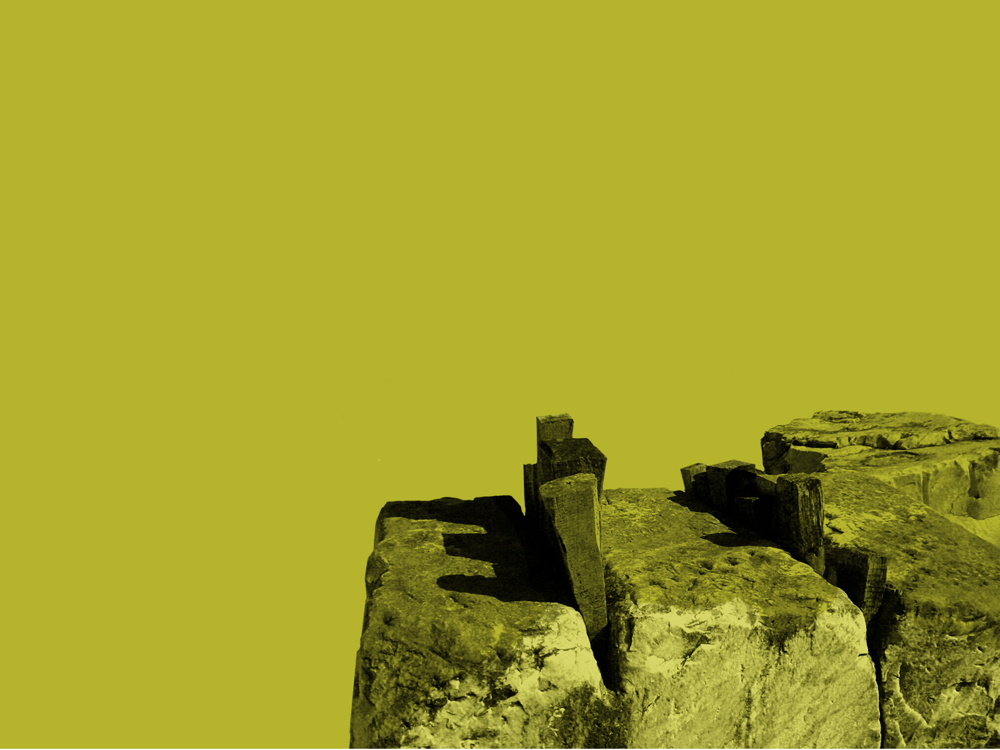

<!-- .slide: class="title logo" -->

# Grand titre I

## sous titre II

### Sous sous titre III

bla bla

---

<!-- .slide: class="programme bg-lion-left" -->

# Programme

## C'est le programme

- Premier **point** du programe
  - et un autre point
- et le **second**
- Lorem **ispum**
- avec [un lien](http://perdu.com)

---

# Titre 1

## titre 2

### Titre 3

- Assumenda asperiores culpa
  - corporis eaque eiu
  - dolorem in
- eos a dolorem in. Ut praesentium aut facilis quia quod ut.
  - dolorem nesciunt
  - repellendus delectus
- Illo dolorem nesciunt corporis eaque eius.

Aliquam *molestias* qui **inventore** repellendus delectus [lien sapiente](/). Molestias voluptatem dolorem aut omnis vel odit.

---

# Slide basique 2

Assumenda asperiores culpa eos a dolorem in. Ut praesentium aut facilis quia quod ut. Illo dolorem nesciunt corporis eaque eius. Aliquam molestias qui inventore repellendus delectus sapiente. Molestias voluptatem dolorem aut omnis vel odit.

---

## Slide basique 3

Assumenda asperiores culpa eos a dolorem in. Ut praesentium aut facilis quia quod ut. Illo dolorem nesciunt corporis eaque eius. Aliquam molestias qui inventore repellendus delectus sapiente. Molestias voluptatem dolorem aut omnis vel odit.

<!--h-->

<!-- .slide: class="bg-rocks" -->

# Slide type titre intermédiaire

## Un sous titre

Du texte

---

## Avec une liste à puce ?

- une liste
  - avec sous puce
  - une autre
- à puce s'il vous plait
- avec du contenu
- avec [un lien](http://perdu.com)

 <!-- .element: height="200px" -->

Notes:

- Des notes

---

## Du code dans cette slide

```python
if galere:
  print("c'est pas bien")
else:
  print("ok c'est tocké")
```

---

<!-- .slide: class="bg-dog-grey" -->

# Titre 1 bg-dog-grey

## Titre 2

### Titre 3

Du texte

---

<!-- .slide: class="bg-dog" -->

# Titre 1 bg-dog

## Titre 2

### Titre 3

Du texte

---

<!-- .slide: class="bg-lenin" -->

# Slide class bg-lenin

## Un sous titre

Du texte

---

<!-- .slide: class="bg-lion-left" -->

# Slide class bg-lion-left
## Un sous titre

Du texte

---

<!-- .slide: class="bg-lion" -->

# Slide bg-lion

## Un sous titre

Du texte

---

<!-- .slide: class="bg-python" -->

# Slide class bg-python

## Un sous titre

Du texte

---

<!-- .slide: class="bg-rocks" -->

# Slide bg-rocks

## Un sous titre

Du texte

---

<!-- .slide: class="alternate" -->

# Titre 1 alternate

## Titre 2

### Titre 3

Du texte

---

<!-- .slide: class="program" -->

# Slide class program

## Un sous titre

Du texte

---

<!-- .slide: class="bg-lion-left program" -->

# Slide class bg-lion-left + program

## Un sous titre

Du texte

---

<!-- .slide: class="progress" -->

# Slide class progress

## Un sous titre

Du texte *et un autre*

- <span>Fait</span>
  - <span>Fait</span>
  - <span>Fait</span>
  - Pas fait
- Pas fait
  - Pas fait
  - Pas fait
- pas fait non plus


<!--h-->

<!-- .slide: class="title" -->

# Slide class title

## Un sous titre

Du texte

---

<!-- .slide: class="logo" -->

# Slide class logo

## Un sous titre

Du texte
